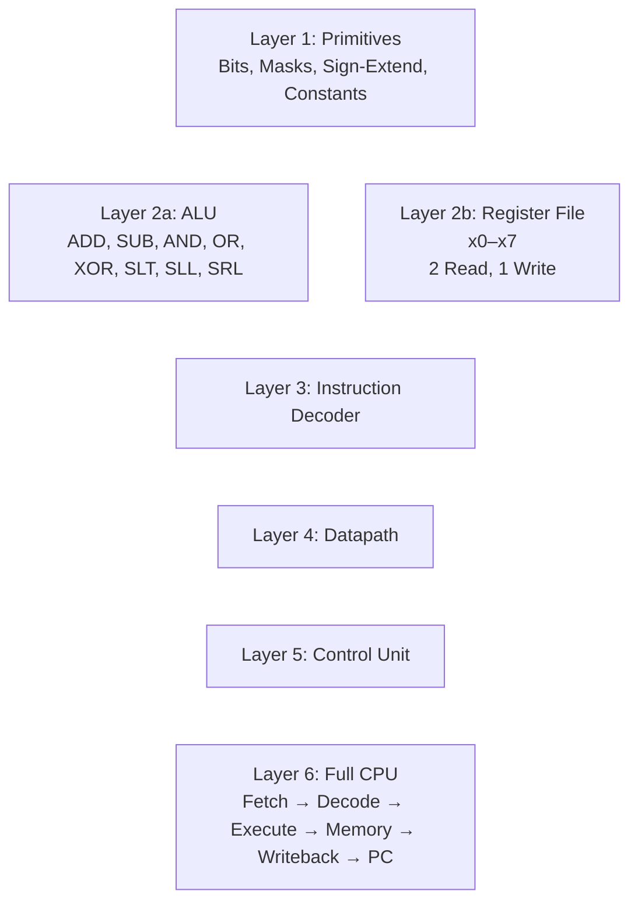

### Build Plan Layers

```mermaid
flowchart TD

L1[Layer 1: Primitives<br/>Bits, Masks, Sign-Extend, Constants]

L2a[Layer 2a: ALU<br/>ADD, SUB, AND, OR, XOR, SLT, SLL, SRL]
L2b[Layer 2b: Register File<br/>x0–x7<br/>2 Read, 1 Write]

L3[Layer 3: Instruction Decoder]
L4[Layer 4: Datapath]
L5[Layer 5: Control Unit]
L6[Layer 6: Full CPU<br/>Fetch → Decode → Execute → Memory → Writeback → PC]

L1 --> L2a
L1 --> L2b
L2a --> L3
L2b --> L3
L3 --> L4
L4 --> L5
L5 --> L6

%% Make arrows white
linkStyle default stroke:#ffffff,stroke-width:2px;

```