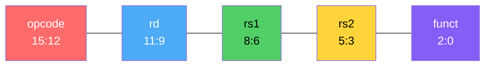
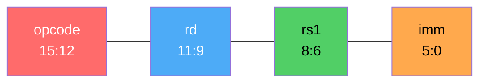
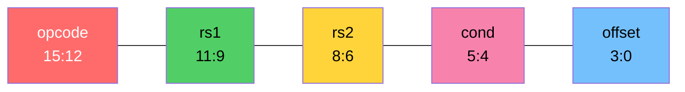
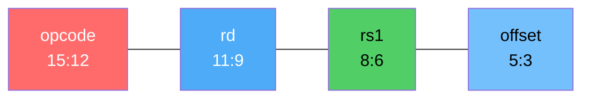
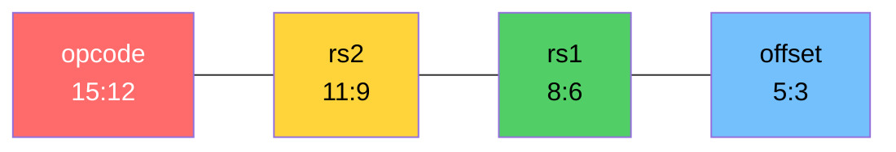

## 🧩 Instruction Formats

---

#### R-Type (REGISTER)

R-type instructions perform operations using only registers. Both input operands are read from the register file (`rs1` and `rs2`), and the result is written back to a destination register (`rd`). The specific operation such as `ADD`, `SUB`, `AND`, or `XOR` is determined by the `funct` field. These instructions are used for pure computation without involving memory or immediate values.

---
#### I-Type (IMMIDIATE)

I-type instructions combine a register operand with a constant value embedded directly in the instruction. The CPU reads one operand from a register (`rs1`) and uses the immediate field as the second operand. The result is written to `rd`. This format is useful for initializing registers, adding constants, or performing quick calculations without needing extra memory access.

---

#### B-Type (BRANCH)

B-type instructions control program flow by conditionally changing the program counter (`PC`). They compare two registers (`rs1` and `rs2`) and evaluate a condition such as equal, not equal, or less than. If the condition is satisfied, the `PC` is updated using the `offset` field, effectively creating loops and decision-making logic in programs.

---
#### L-Type (LOAD)

L-type instructions are used to read data from memory. The effective memory address is computed using a base register (`rs1`) and an `offset`. The value stored at that memory location is then loaded into the destination register (`rd`). These instructions allow the CPU to bring external data into the register file for processing.

---

#### S-Type (STORE)

S-type instructions write data from a register into memory. The address is computed using a base register (`rs1`) and an offset, similar to load instructions. The value from the source register (`rs2`) is then stored at that memory location. These instructions enable the CPU to save results or intermediate data back into memory.

